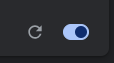

# Bookmark Updater Chrome Extension

## Overview
The Bookmark Updater is a Chrome extension designed to automatically update specified bookmarks with new URLs based on defined namespaces. It operates in the background, ensuring that the bookmarks are updated whenever the extension is installed or updated.

## Installation
To install the extension locally:
1. Clone the repository or download the files to your local machine.
2. Open Chrome and navigate to `chrome://extensions/`.
3. Enable "Developer mode" by toggling the switch in the upper right corner.
4. Click "Load unpacked" and select the `bookmark_updater` directory.
5. The extension should now be visible in the Chrome toolbar.

## Configuration
The extension uses the following configuration:
- **Old Namespace**: The part of the URL that needs to be replaced.
- **New Namespace**: The new part of the URL that replaces the old namespace.
- **Bookmarks to Update**: A list of bookmark titles that the extension will search for and update.

### Default Configuration (in `background.js`)

```javascript
const oldNamespace = 'ci-ska-mid-itf-at-2226-determine-stable-versions';
const newNamespace = 'staging';

const bookmarksToUpdate = [
    'Test Equipment',
    'Telescope',
    'TMC',
    'CSP Monitoring',
    'SDP Integration', 
    'CBF Overview',
    'SDP Signal Displays',
    'SKA001',
    'SKA036'
];
```

## Usage
- Once installed, the extension runs automatically in the background.
- It checks the specified bookmarks and updates their URLs based on the configured namespaces.
- It will skip any URLs that do not contain the old namespace.
- No user interaction is required after the initial setup.

## Modifying the Extension
To modify the list of bookmarks or the namespaces that need changing:
1. Open `background.js` in the `bookmark_updater` directory.
2. Edit the `oldNamespace`, `newNamespace`, and `bookmarksToUpdate` variables as needed.
3. Save your changes.
4. Reload the extension in Chrome by going to `chrome://extensions/` and clicking the "Reload" button under the Bookmark Updater extension next to the enable toggle.

    

## Additional Notes
- The extension logs updates to the Chrome DevTools console, which can be accessed via `chrome://extensions/` > "Inspect views" under the Bookmark Updater extension.
- If you encounter issues, try reloading the extension from the Chrome Extensions page.
- The extension does not require any permissions beyond access to bookmarks, ensuring it operates securely and efficiently.

